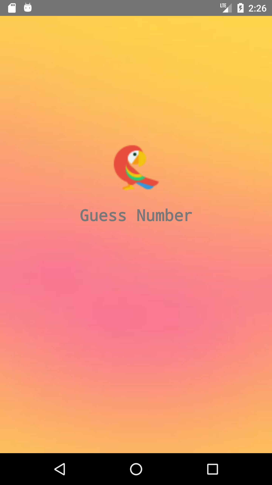
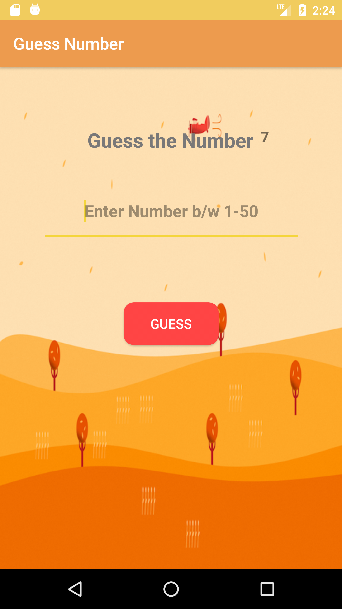
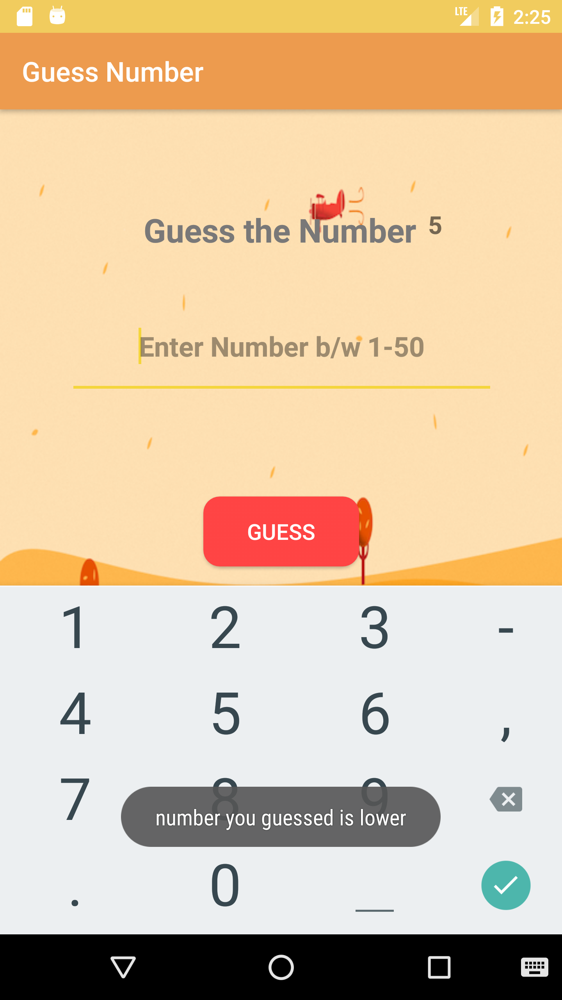

</img>
</img>
 
Android application game based on Binary Search Algorithm user have to guess a number between 1-50 randomly generated by application in 7 chances.

# Screenshots

</img>
</img>
</img>
</img>
</img>
